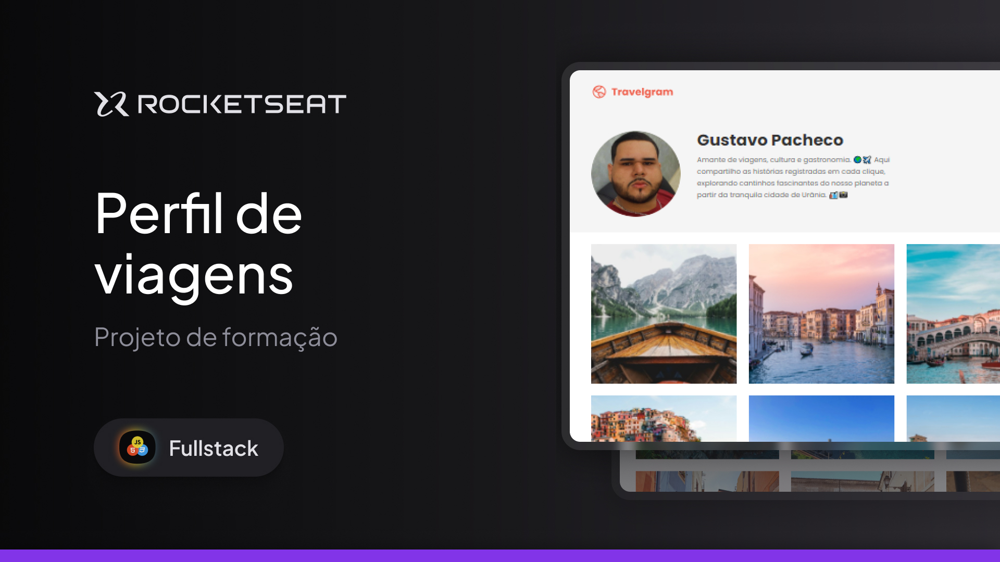

# ✈️ Perfil de Viagens  

Projeto desenvolvido durante meus estudos na **Rocketseat**, onde construí um **Perfil de Viagens** utilizando HTML e CSS. O objetivo foi praticar a estruturação de páginas web, estilização e interatividade.  

  

## 🚀 Tecnologias Utilizadas  

- HTML5  
- CSS3   

## 📌 Funcionalidades

- ✅ **Hover interativo** na parte do **header** (Explore) e nas **minhas viagens**
- ✅ **Perfil personalizado** com foto e descrição
- ✅ **Galeria de imagens** das viagens
- ✅ **Layout responsivo** e moderno 

## 🎨 Layout  

O design foi baseado nas diretrizes apresentadas durante o curso da **Rocketseat**, proporcionando uma experiência fluida e intuitiva.  

## 📂 Como Executar o Projeto  

1. Clone o repositório:  
```bash
git clone https://github.com/gustavopmb/projeto-perfil-viagens.git
```
2. Acesse a pasta do projeto:
```bash
  cd projeto-perfil-viagens
```
3. Abra o arquivo `index.html` no navegador.

## 📜 Licença

Este projeto foi desenvolvido para fins educacionais e está sob a licença MIT.

---

Feito com 💜 por Gustavopmb by Rocketseat 🚀
